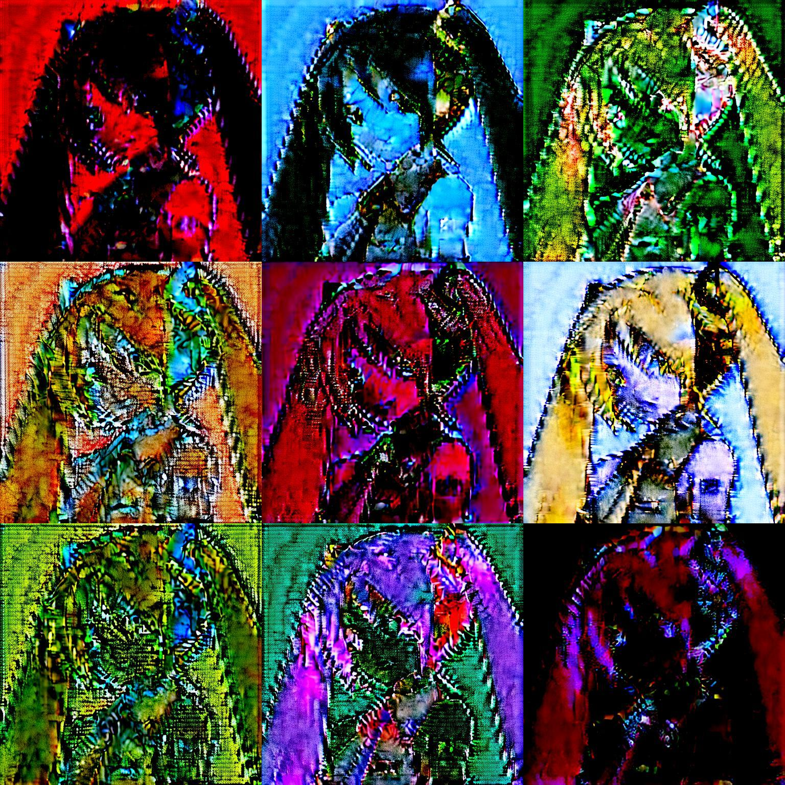
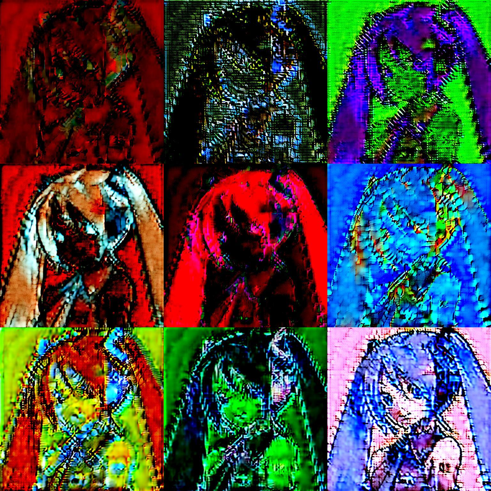
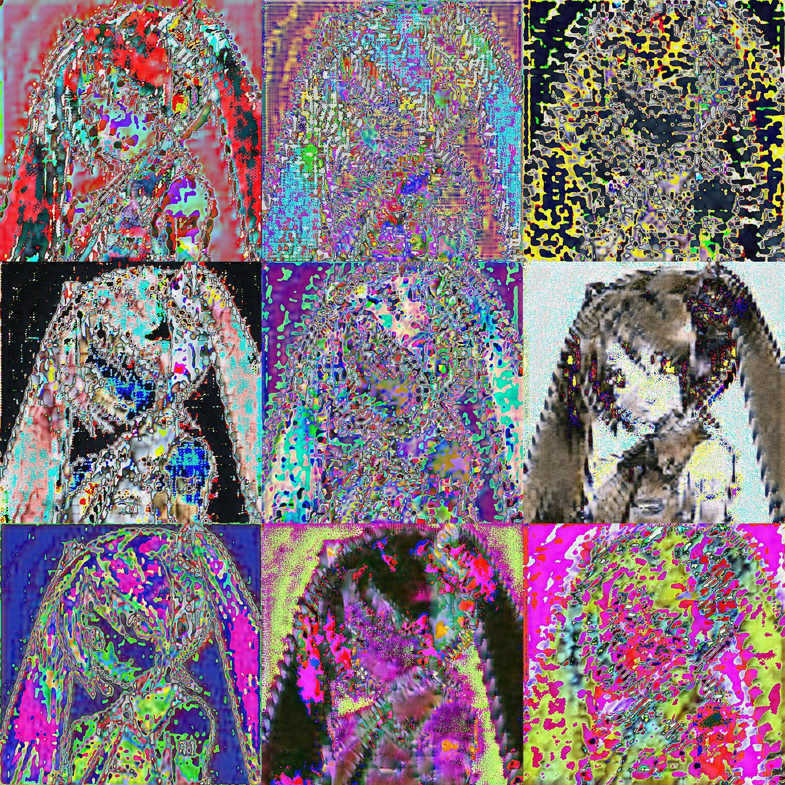
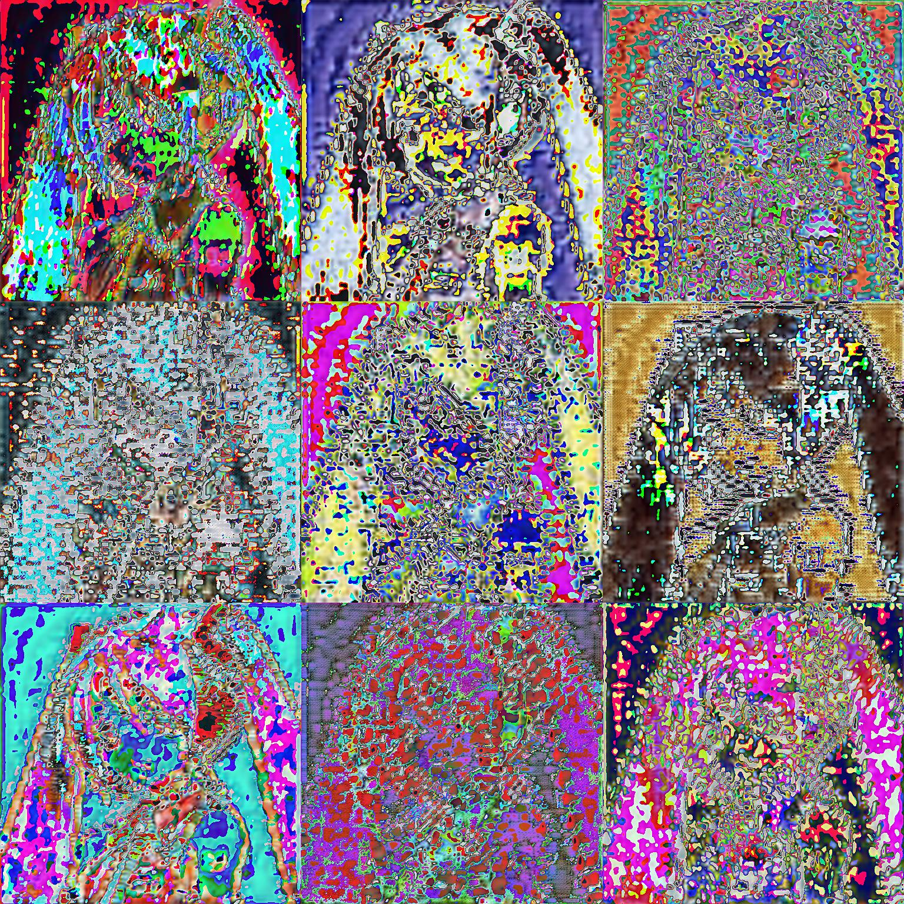

# random_perturbation_in_latent_space





this is an experimental and fun approach to image processing. the idea is to encode given image into latent space, apply perturbation using random generated matricies, and then decode them back. 
you can see nonlinear and random transformation of the original image.

## Usage

clone this repo and install the requirements:

```bash
git clone https://github.com/wowowo-wo/random_perturbation_in_latent_space
cd random_perturbation_in_latent_space
pip install -r requirements.txt
python3 cli.py --img_path PATH [--matrix_type type of matrix] [--n N] [--lb lower bound for uniform float] [--ub upper bound for uniform float] [--density density for sparse float] [--p degrees of freedom for wishart N] [--seed random seed N]
```

or you can run this tool with a GUI using Streamlit:

```bash
pip install streamlit
streamlit run gui.py
```

then, open the URL shown in your brouser.

### Parameters

--img_path Path to the target image. (required)

--matrix_type Type of matrix which operates in latent space. default is gaussian. options includes gaussian, uniform, orthogonal, symmetric, permutation, sparse, diagonal, wishart.

--n Number of steps to repeat the process with different random matricies. default is 1.

--lb Lower bound for values in uniform matricies. default is 0.0

--ub Upper bound for values in uniform matricies. default is 1.0.

--density Density for sparce matricies. default is 0.1.

--p Degrees of freedom for the wishart matrix. default is C = dimension of a latent vector.

--mode 

default: Pixel values are clamped to the [0, 1] range, so the output image always looks clean and reasonable.

experimental: Disables clamping — so you can see raw pixel values, even if they go outside [0, 1].
This is useful for debugging, visualizing outliers, or inspecting the effects of things like latent space transforms or added noise.

In contrast to the images at the beginning of this README, which are generated in default mode, you can see "collapsed" images like the ones below when using experimental mode.







## Requirements

```bash
pip install -r requirements.txt
```

## Takeaway

All the images included in this README were created using this repo - they are
made by stitching together outputs generated with it.

Whats interesting is that, when I look back on how I made them, the whole process seems to offer one possible answer to the question 'What is the role of humans in the age of AI?'

Concretely, the workflow is the following:

1. Come up with an idea for an image processing concept

2. Write the code(using chatGPT)

3. Run the process over and over, tweaking parameters as needed

4. From about 2000 generated images, pick the ones I liked and combine them into a 3×3 grid

People sometimes say "AI is taking our jobs." But looking at this process, it feels more like the opposite:

Ideas and personal taste are becoming more important than ever.

Perhaps the role of humans in the age of AI is to work effectively with new tochnologies, acting more like an "editor".
